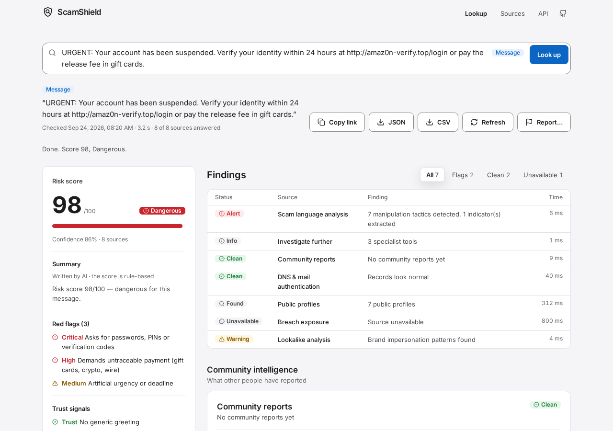

# ScamShield

Look up an email address, link, domain, IP address, phone number or message against public threat-intelligence sources and get an explained risk score.

<picture>
  <source media="(prefers-color-scheme: dark)" srcset="docs/screenshot-dark.png" />
  
</picture>

## What it does and doesn't do

- Queries 20+ public sources in parallel and streams each answer to the page as it arrives.
- Combines their findings into a deterministic 0–100 score and lists every signal behind it.
- Uses public data only. It never emails, calls or logs into anything, and never contacts the target.
- Never shows leaked passwords, and doesn't log looked-up values in request logs.
- Results are indicators, not proof. Don't use ScamShield to stalk or harass people.

## What it checks

| Target | Sources |
|---|---|
| **Email** | Breaches (**XposedOrNot**, **Have I Been Pwned**¹), **infostealer malware logs** (Hudson Rock Cavalier), **Gravatar** profile and verified accounts, **GitHub** commit authorship, **PGP** keys, disposable-provider list (~9k domains), free-mailbox brand impersonation (`paypal.support@gmail.com`), role accounts, MX / SPF / DMARC, domain age and blocklists for custom domains |
| **URL** | `@`-userinfo tricks, raw-IP hosts, shorteners, non-standard ports, executable downloads, phishing-kit personalisation (`?email=victim@…`), open redirects, free-hosting abuse, **Google Safe Browsing**¹, **URLhaus**¹, plus all domain checks |
| **Domain** | **RDAP** registration age, registrar and hold status, typosquatting (Levenshtein), **homograph/IDN** attacks (mixed-script punycode, confusable skeletons), brand-in-subdomain, abused TLDs, **Spamhaus DBL / SURBL / URIBL**, TLS certificate (SSRF-guarded), DNS and mail authentication |
| **IP** | RDAP network owner, country and abuse contact, reverse DNS, hosting detection, **Spamhaus ZEN / SpamCop / DroneBL**, **AbuseIPDB**¹ |
| **Phone** | libphonenumber validity, country, **line type** (mobile, VoIP, premium-rate, toll-free…), Wangiri international ranges, community reports |
| **Message** | 17 social-engineering tactics (credential/OTP requests, advance fee, gift-card and crypto payment, legal threats, fake delivery, remote-access tools…), **tactic combinations**, and extraction of links, emails and numbers with one-click follow-up lookups |
| **All** | Community reports (de-duplicated per reporter), a curated known-scam list, and deep links to VirusTotal, urlscan, Shodan, crt.sh, Epieos, Truecaller and others |

¹ Optional. The source switches on when its API key is set (see [Configuration](#configuration)). Everything else works without keys.

## Quick start

```bash
git clone https://github.com/isaac-onyango-dev/scamshield.git
cd scamshield
npm install
cp .env.example .env        # optional: add API keys
npm run dev                 # http://localhost:5000 (API + Vite HMR on one port)
```

Production:

```bash
npm run build
NODE_ENV=production SITE_URL=https://scamshield.example npm start
# or
docker build -t scamshield .
docker run -p 5000:5000 -v scamshield-data:/data -e SITE_URL=https://scamshield.example -e STORAGE_PERSISTENT=true scamshield
```

Migrations and seeding run on boot. Render, Docker and VPS instructions are in [DEPLOYMENT.md](DEPLOYMENT.md).

## Configuration

Every variable is validated at startup (`server/config.ts`); a bad value stops the server with a clear message. The full list with comments is in [`.env.example`](.env.example). Only names are listed here.

| Variable | Default | Purpose |
|---|---|---|
| `SITE_URL` | none (**required in production**) | Public `https` origin for absolute `og:url` / `og:image`. On Render, `RENDER_EXTERNAL_URL` is used when it's unset. |
| `STORAGE_PERSISTENT` | `false` | Set to `true` only when `DATABASE_URL` survives restarts. While `false`, the UI says reports are stored temporarily and counts "since last restart". |
| `DATABASE_URL` | `sqlite.db` | SQLite file. Put it on a persistent disk or volume in production. |
| `PORT`, `NODE_ENV`, `LOG_LEVEL`, `TRUST_PROXY` | `5000`, `development`, `info`, `1` | Server basics. `TRUST_PROXY` must equal the number of proxies in front of the app. |
| `REPORTER_SALT` | development value | Long random string used to hash reporter IPs. |
| `RATE_LIMIT_LOOKUPS_PER_MINUTE`, `RATE_LIMIT_REPORTS_PER_HOUR` | `20`, `10` | Per-IP rate limits. |
| `LOOKUP_CACHE_TTL_MINUTES`, `CHECK_TIMEOUT_MS`, `DEFAULT_PHONE_REGION`, `DNS_SERVERS` | `360`, `8000`, `US`, system | Lookup behaviour. |
| `HIBP_API_KEY`, `GOOGLE_SAFE_BROWSING_KEY`, `URLHAUS_AUTH_KEY`, `ABUSEIPDB_API_KEY`, `GITHUB_TOKEN`, `GRAVATAR_API_KEY` | empty | Optional sources (see ¹ above). |
| `OPENAI_API_KEY`, `OPENAI_MODEL` | empty, `gpt-4o-mini` | Optional AI-written summaries. The score is never AI-generated. |

> **Demo deployments without a disk** (for example Render Free) lose community reports and counters on every restart. Leave `STORAGE_PERSISTENT` unset there; the app then tells users so.

## Using the app

1. **Look up.** Paste an indicator or a whole message and press Enter (Shift+Enter adds a new line). The type is detected as you type, and defanged input such as `hxxp://evil[.]com` works.
2. **Read the result.** Sources fill in as they answer. The verdict shows the score, a written level, confidence, the top red flags (each linked to its source) and what to do. The findings table lists every source with its status; filter it by Flags, Clean or Unavailable.
3. **Copy and export.** Copy any fact or the indicator itself, copy a link to the lookup, or export the full report as **JSON** or **CSV**. CSV cells that start with `=`, `+`, `-`, `@`, tab or carriage return are prefixed with `'` so spreadsheets don't execute them.
4. **Refresh** skips the cache and asks every source again; the current results stay on screen meanwhile.
5. **Report…** adds a community report (one per reporter per target). Reports are stored temporarily on demo deployments without persistent storage.
6. **Rate limits.** When you hit the lookup limit, the page counts down until you can try again.

## API

```bash
# Full JSON report (type auto-detected; add &type=email etc. to force; &fresh=1 bypasses the cache)
curl -G localhost:5000/api/lookup --data-urlencode "q=paypal-secure-login.xyz"

# Live stream: start -> check (per source) -> done
curl -N -G localhost:5000/api/lookup/stream --data-urlencode "q=someone@example.com"

# Community report
curl -X POST localhost:5000/api/reports -H 'content-type: application/json' \
  -d '{"query":"amaz0n-verify.top","category":"phishing","description":"SMS lure"}'
```

Also `GET /api/sources`, `GET /api/stats` and `GET /api/health`. Responses carry the standard `RateLimit` headers, and a `429` includes `Retry-After`. All response types live in [`shared/types.ts`](shared/types.ts); the in-app reference is at `/api-docs`.

## How scoring works

Each source emits **signals**: `risk` or `trust`, with severity `low | medium | high | critical`. Signals are treated as independent evidence and combined as `1 − Π(1 − wᵢ)`. Trust signals (for example a domain that's 10 years old, enforced DMARC, or a long public footprint) dampen the result, but **a critical finding such as a blocklist hit or a known scam can never be pushed below 80**. Two independent high-severity findings floor the score at 60. The UI lists every signal behind the number, and *confidence* shows how many sources actually answered.

AI (optional, via `OPENAI_API_KEY`) only writes the plain-language summary, and the UI labels it as such. It never changes the score.

## Architecture and deployment

- [ARCHITECTURE.md](ARCHITECTURE.md): engine, streaming, scoring, security and data model.
- [DEPLOYMENT.md](DEPLOYMENT.md): Render blueprint, Docker, VPS and the production checklist.
- [docs/REDESIGN_PLAN.md](docs/REDESIGN_PLAN.md) and [docs/REDESIGN_CHECKLIST.md](docs/REDESIGN_CHECKLIST.md): the design system and its definition of done.

## Development

```bash
npm run check            # TypeScript (server, client, tests)
npm test                 # 157 unit and integration tests (vitest + supertest)
npm run test:e2e         # Playwright: features, UI states, keyboard, axe (Chromium)
npm run lint:design      # design-system rules: tokens only, no gradients, emoji or marketing copy
npm run check:contrast   # WCAG AA contrast of every colour token pair, light and dark
npm run db:generate      # new migration after editing shared/schema.ts
npm run data:disposable  # refresh the disposable-email domain list
npm run fonts:vendor     # re-copy the self-hosted fonts after bumping @fontsource-variable
npm run brand:render     # re-render favicon/OG PNGs from the brand SVGs
```

The UI is styled only through the tokens in [`client/src/styles/tokens.css`](client/src/styles/tokens.css) (one blue accent, success/warning/danger, an 8-step type scale, 4 px spacing, motion ≤ 200 ms), exposed to Tailwind in [`tailwind.config.ts`](tailwind.config.ts). The e2e specs talk to the UI through [`tests/e2e/support/app.ts`](tests/e2e/support/app.ts), and every API call in them is mocked.

Adding a source is a single file: implement `CheckDefinition` (`server/engine/types.ts`) and register it in `server/checks/index.ts`. The runner handles concurrency, timeouts, abort, error isolation, streaming and the Sources page.

## Accessibility

ScamShield targets **WCAG 2.2 AA** in light and dark mode:

- Every colour pair passes contrast (`npm run check:contrast`), and statuses are always written as words with a distinct icon, never shown by colour alone.
- Full keyboard use: skip link, visible focus ring, arrow-key filters, and a modal report dialog that returns focus.
- `prefers-reduced-motion` stops all animation. The only live region announces lookup progress and the result once.
- CI runs axe on every page and state at desktop and 375 px width, and fails on any violation.

Found a barrier? Please [open an issue](https://github.com/isaac-onyango-dev/scamshield/issues).

## License

MIT for the code. Inter and JetBrains Mono are bundled under the SIL Open Font License 1.1 ([`client/public/fonts/OFL-Inter.txt`](client/public/fonts/OFL-Inter.txt), [`client/public/fonts/OFL-JetBrainsMono.txt`](client/public/fonts/OFL-JetBrainsMono.txt)).
