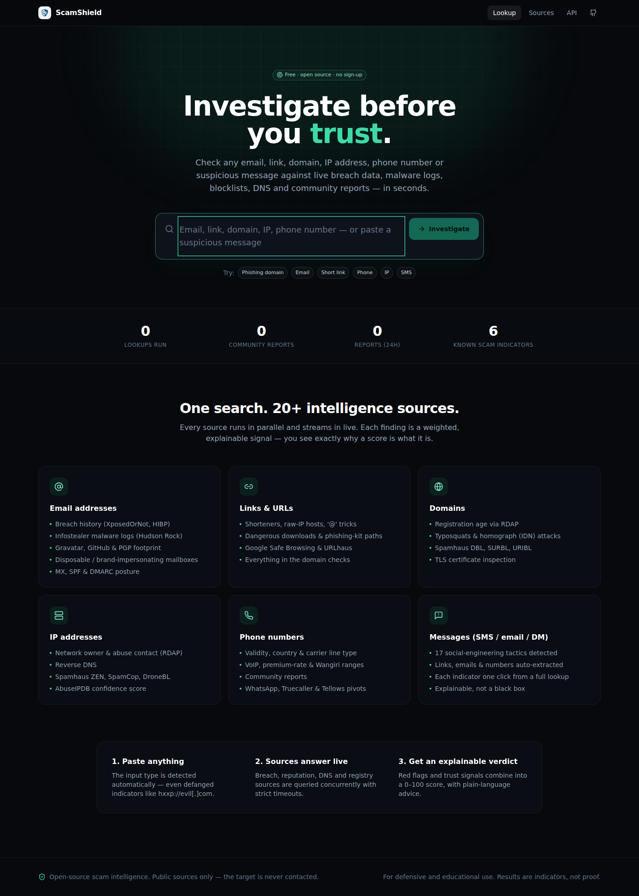
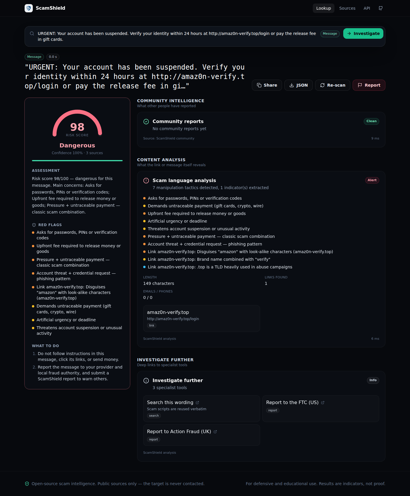

# ScamShield

**Open-source OSINT & scam-intelligence engine.** Paste an email address, link, domain, IP, phone number or a whole suspicious message. ScamShield queries 20+ live intelligence sources in parallel, streams each result as it arrives, and gives you an **explainable** 0–100 risk score with plain-language advice.

It works like hosted tools such as EmailOSINT (breach history, infostealer logs, public profiles) but also covers links, domains, IPs, phone numbers and message text. It's self-hostable, MIT-licensed, and every score can be traced back to the evidence behind it.



> Public sources only: ScamShield never emails, calls, or logs into anything, and never contacts the target.

---

## What it checks

| Target | Intelligence sources |
|---|---|
| **Email** | Breaches (**XposedOrNot**, **Have I Been Pwned**¹), **infostealer malware logs** (Hudson Rock Cavalier), **Gravatar** profile & verified accounts, **GitHub** commit authorship, **PGP** keys, disposable-provider list (~9k domains), free-mailbox brand impersonation (`paypal.support@gmail.com`), role accounts, MX / SPF / DMARC, domain age & blocklists for custom domains |
| **URL** | `@`-userinfo tricks, raw-IP hosts, shorteners, non-standard ports, executable downloads, phishing-kit personalization (`?email=victim@…`), open redirects, free-hosting abuse, **Google Safe Browsing**¹, **URLhaus**¹, plus all domain checks |
| **Domain** | **RDAP** registration age / registrar / hold status, typosquatting (Levenshtein), **homograph/IDN** attacks (mixed-script punycode, confusable skeletons), brand-in-subdomain, abused TLDs, **Spamhaus DBL / SURBL / URIBL**, TLS certificate (SSRF-guarded), DNS & mail auth |
| **IP** | RDAP network owner, country & abuse contact, reverse DNS, hosting detection, **Spamhaus ZEN / SpamCop / DroneBL**, **AbuseIPDB**¹ |
| **Phone** | libphonenumber validity, country, **line type** (mobile / VoIP / premium-rate / toll-free…), Wangiri international ranges, community reports |
| **Message** | 17 social-engineering tactics (credential/OTP requests, advance fee, gift-card & crypto payment, legal threats, fake delivery, remote-access tools…), **tactic combinations**, and automatic extraction of links, emails and numbers with one-click pivots |
| **All** | Community reports (per-reporter de-duplicated), curated known-scam list, and deep links to VirusTotal, urlscan, Shodan, crt.sh, Epieos, Truecaller and others |

¹ Optional. The source switches on when its API key is set; see [`.env.example`](.env.example). Everything else works without keys.

<details><summary>Example: a phishing SMS analysed</summary>



</details>

## Quick start

```bash
git clone https://github.com/isaac-onyango-dev/scamshield.git
cd scamshield
npm install
cp .env.example .env        # optional: add API keys
npm run dev                 # http://localhost:5000 (API + Vite HMR on one port)
```

Production:

```bash
npm run build && npm start
# or
docker build -t scamshield . && docker run -p 5000:5000 -v scamshield-data:/data scamshield
```

Migrations and seeding run automatically on boot. Deployment options (Render blueprint, Docker, VPS) are in [DEPLOYMENT.md](DEPLOYMENT.md).

## API

```bash
# Full JSON report (type auto-detected; add &type=email etc. to force; &fresh=1 bypasses cache)
curl -G localhost:5000/api/lookup --data-urlencode "q=paypal-secure-login.xyz"

# Live stream: start → check (per source) → done
curl -N -G localhost:5000/api/lookup/stream --data-urlencode "q=someone@example.com"

# Community report
curl -X POST localhost:5000/api/reports -H 'content-type: application/json' \
  -d '{"query":"amaz0n-verify.top","category":"phishing","description":"SMS lure"}'
```

Also `GET /api/sources`, `GET /api/stats` and `GET /api/health`. All response types live in [`shared/types.ts`](shared/types.ts).

## How scoring works

Each source emits **signals**: `risk` or `trust`, with severity `low | medium | high | critical`. Signals are treated as independent evidence and combined as `1 − Π(1 − wᵢ)`. Trust signals (for example a domain that's 10 years old, enforced DMARC, or a long public footprint) dampen the result, but **a critical finding such as a blocklist hit or a known scam can never be pushed below 80**. Two independent high-severity findings floor the score at 60. The UI lists every signal behind the number, and *confidence* shows how many sources actually answered.

AI (optional, via `OPENAI_API_KEY`) only writes the plain-language summary. It never changes the score.

## Development

```bash
npm run check    # TypeScript (server, client, tests)
npm test         # 100 unit + integration tests (vitest + supertest)
npm run db:generate      # new migration after editing shared/schema.ts
npm run data:disposable  # refresh the disposable-email domain list
```

Adding a source is a single file: implement `CheckDefinition` (`server/engine/types.ts`) and register it in `server/checks/index.ts`. The runner handles concurrency, timeouts, abort, error isolation, streaming and the Sources page. See [ARCHITECTURE.md](ARCHITECTURE.md).

## Responsible use

ScamShield is built to help people **decide whether to trust something that contacted them**, and to help defenders triage indicators. It shows only data that is already public, never displays leaked passwords, and doesn't log looked-up values in request logs. Don't use it to stalk or harass individuals. Results are indicators, not proof.

## License

MIT
